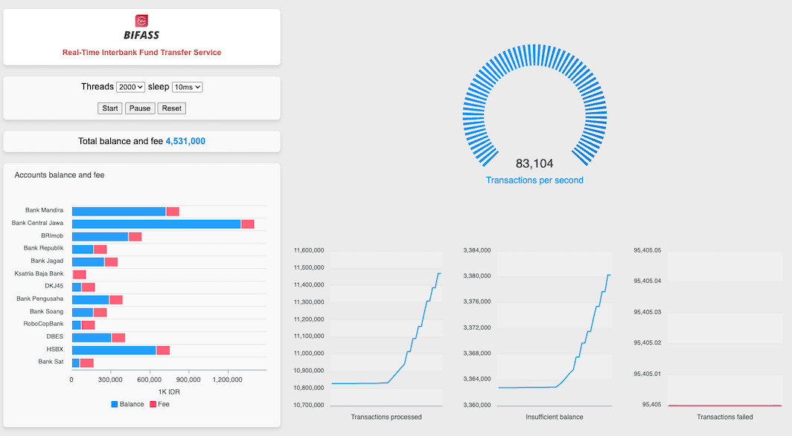

# biFASS Redis Real-Time Interbank Fund Transfer Service

Sample Golang code for simulating a high-performance interbank fund transfer service, utilizing Redis Functions to allow atomicity counters for perfoming balance deductions and service fees.

More about Redis Functions:
https://redis.io/docs/latest/develop/interact/programmability/functions-intro/



## How to run the example

1 - Run a local Redis Stack server, Redis docker image, or create a Redis Cloud database:

```
docker run -d --name redis-stack-server -p 6379:6379 redis/redis-stack-server:latest
```

2 - Initialize the Go modules and run the app:

```
go mod init bifass
go mod tidy
go run .
```

3 - Open web browser and point it to:

```
http://localhost:8080
```

4 - Click "Start" to start the random transfer between the accounts

5 - Change the number of threads and see how it impacts the transaction throughput

6 - Redis Software failover and resiliency simulation can be done to see how it impacts the total balance and fee consistency